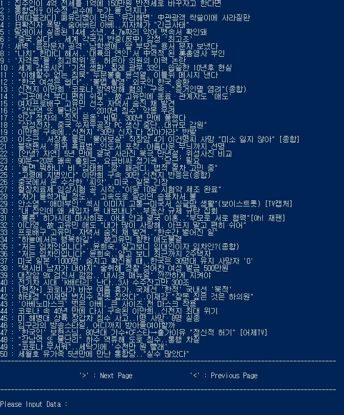
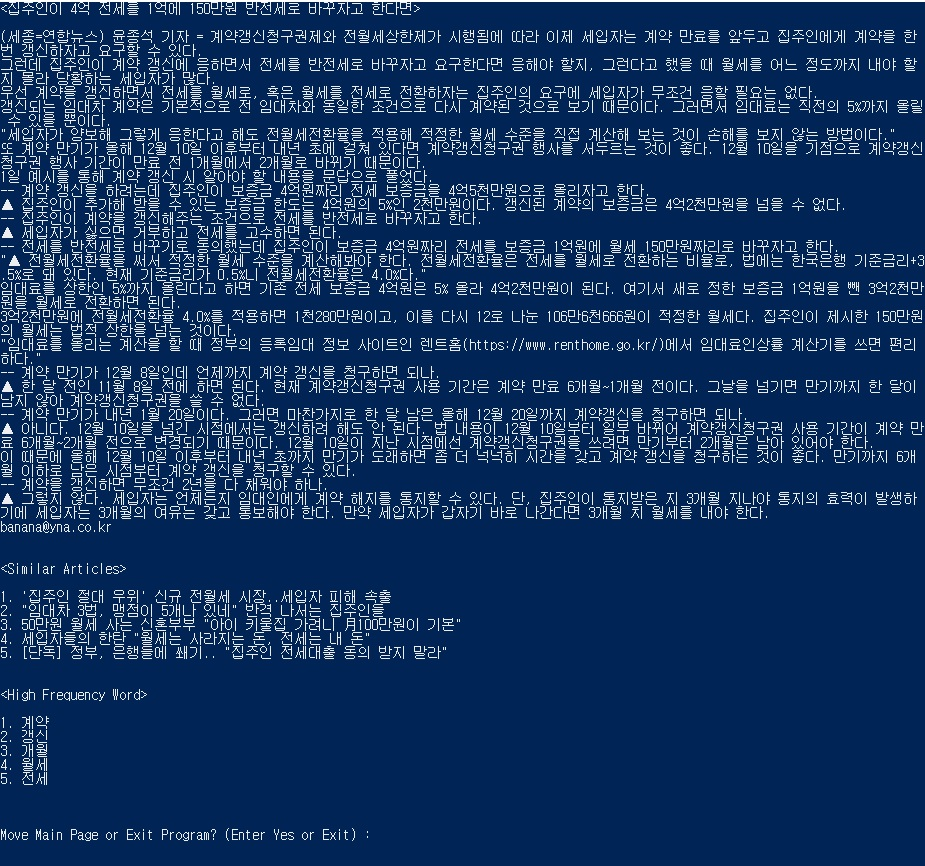
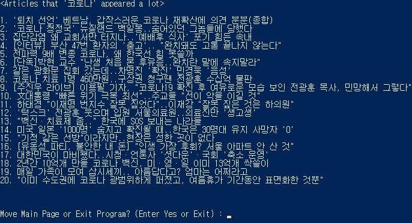

# Document Recommendation Using Similarity Check
## Outline
Document Recommendation Program Using Similarity Check.<br>
The program can be used for any document in title-body format, such as news articles, song lyrics, book plots, etc.<br>
I used the articles read a lot by date on https://news.daum.net/ as document data.<br>
## Packages & Modules
```
pip install --upgrade pip
```
You need to upgrade the recent version pip with the above command.<br>

### Beautiful Soup
```
pip install beautifulsoup4
```
Install beautifulsoup4 for web crawling.
### Requests
```
pip install requests
```
Install requests for web crawling.
### Konlpy
[Konlpy Installation Manual](https://konlpy-ko.readthedocs.io/ko/v0.4.3/install/)  
Install konlpy for korean information processing
### Eunjeon
```
pip install eunjeon
```
Instal eunjeon for use mecab, a morpheme analyzer with the best performance
### Scikit-learn
```
pip install scikit-learn
```
Install scikit-learn for convert the document to a vectorized matrix and compute it
## How to use
1. Run crawling.py and get the data. The data is saved in output.txt.<br>
2. Run make_matrix_voca.py to get a vectorized document matrix and wordbook.<br> 
The vectorized matrix is stored in matrix.txt and the wordbook is stored in voca.txt.<br>
3. Run main.py<br><br>
<br>
The title of the article is displayed.<br><br>
4. Input '>' or '<'<br><br>
<br>
Prints a list of the titles of the next or previous page.<br><br>
5. Input article title or word<br><br>
**Input article title**<br>
<br><br>
**Result of the input article title**<br>
<br>
The article text, similar articles, and a list of words that appear in the text are displayed.<br><br>
**Input word**<br>
<br><br>
**Result of the input word**<br>
<br>
The title of the article in which the entered word appears the most is displayed.<br><br>
6. If you want to exit the program. Input 'exit'<br><br>
<br><br>
## Additional Implementation
**makeVocabjson.py**<br>
Although it is not necessary for the operation of the whole program, I created a word dictionary for the entire document data to cultivate the ability to use the json file format and the Python library.<br><br>
**Execution time**<br>
In the process of converting all 1000 documents into vectorized matrices and obtaining word-similarity and document-word frequency vectors, too much time is consumed, which takes a long time to execute the entire program.<br>
Through the code of make_matrix_voca.py, the vectorized matrix is saved in matrix.txt and words are stored in voca.txt in advance, reducing the overall program execution time.<br>
